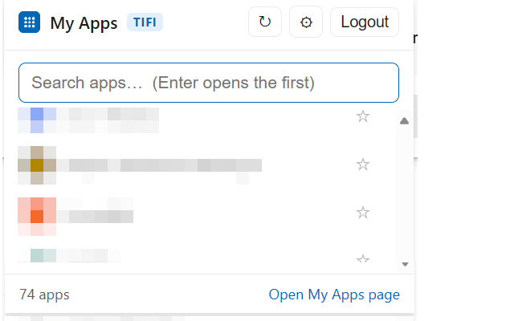

# My Apps Launcher (TIFI) - Edge, Chrome, and Firefox

*Part of the "There I Fixed It" (TIFI) collection.*

A lightweight replacement for the official *My Apps Secure Sign-in* extension,
built because that extension's popup search bar is broken. This one gives you a
working, searchable list of your Microsoft **My Apps** portal applications right
from the toolbar.

## What it does

- **Login button** when you're signed out or your session has expired. Opens
  the normal Microsoft login flow.
- **Full app list** once you're signed in.
- **Search bar** that filters the list as you type. Press **Enter** to open the
  top result. **↑ / ↓** move the selection.
- **Click any app** to open it immediately (single sign-on link).
- **Recent section** at the top: the extension remembers your last 100 opens
  and promotes your most-used apps into a "Recent" group. Apps shown there are
  removed from the "All apps" list below so nothing is duplicated.
- **Refresh** (⟳) re-syncs your list, and **Logout** clears the session so you
  can sign in as someone else.
- **Settings** (⚙) opens a full page where you can see everything the extension
  has stored (status, tenant ID, cached apps, usage history, and the raw JSON),
  adjust preferences (Recent size, ordering, background sync), and clear any of
  it. From there you can clear history, clear cached apps, or reset everything.

## How it gets your apps ("auto tab sync")

Microsoft's My Apps portal loads your app tiles from a private, token-protected
endpoint, so the extension can't just call it directly. Instead it uses **your
existing signed-in browser session**:

1. When you open the popup (or hit Refresh), the extension opens a
   background My Apps tab (or reuses one you already have open).
2. A content script on that page captures your app tiles, both from the
  portal's own network response and from the rendered page, and caches them.
3. The background tab is closed automatically, and your list appears in the popup.

Nothing leaves your machine: the app list is stored only in the browser's local
extension storage. No third-party servers are contacted.

## Project layout

The extension source lives in **`src/`** (one shared codebase for all browsers);
packaged zips are written to **`dist/`**. See `BROWSERS.md` for the packaging
commands and browser-specific notes.

## Install

Available on the Chrome Web Store here: https://chromewebstore.google.com/detail/My%20Apps%20Launcher%20%28TIFI%29/diglkahdhoipellainhmhdolgagddehd

### Manual Install (Edge / Chrome)

1. Download and extract the zip from the release https://github.com/finite8/tifi-ms-apps-launcher/releases
2. Open **edge://extensions**.
3. Turn on **Developer mode** (toggle, bottom-left).
4. Click **Load unpacked** and select the **`src`** folder.
5. Pin the extension: click the puzzle-piece icon in the toolbar and pin
   "My Apps Launcher (TIFI)".

The same folder also loads in Chrome via **chrome://extensions → Load unpacked**.

### Manual Install (Firefox)

1. Download and extract the zip from the release https://github.com/finite8/tifi-ms-apps-launcher/releases
2. Open **about:debugging#/runtime/this-firefox**.
3. Click **Load Temporary Add-on…**.
4. Select the extension **`manifest.json`** from the extracted **`src`** folder.

For permanent installation in Firefox, publish the Firefox zip to AMO (addons.mozilla.org).

## First run

Click the toolbar icon. If you're not signed in, click **Log in to My Apps** and
complete the normal Microsoft sign-in. After that, open the popup again and your
apps will be listed. Use Refresh anytime the list looks stale.

## Notes & troubleshooting

- **First sync after login** may take a few seconds while the portal loads.
- If the list is empty right after signing in, click **⟳ Refresh** once. The
  portal sometimes needs a moment to finish authenticating.
- My Apps uses an **undocumented internal API** that Microsoft can change without
  notice. The capture logic is deliberately flexible (it tries several field
  names and also reads the page directly), but if Microsoft overhauls the portal
  the selectors in `content.js` / `injected.js` may need a small update.
- This extension is unofficial and not affiliated with Microsoft.
